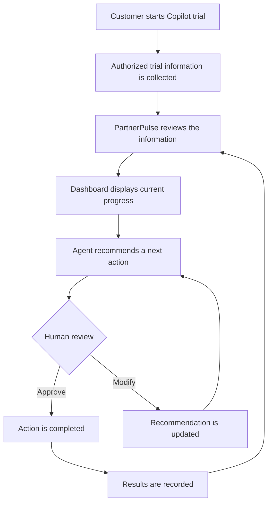
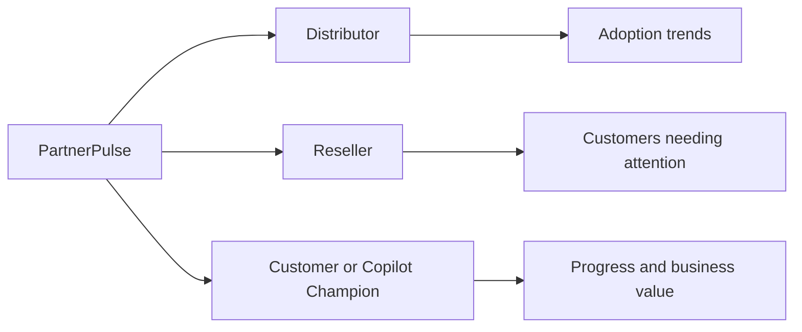
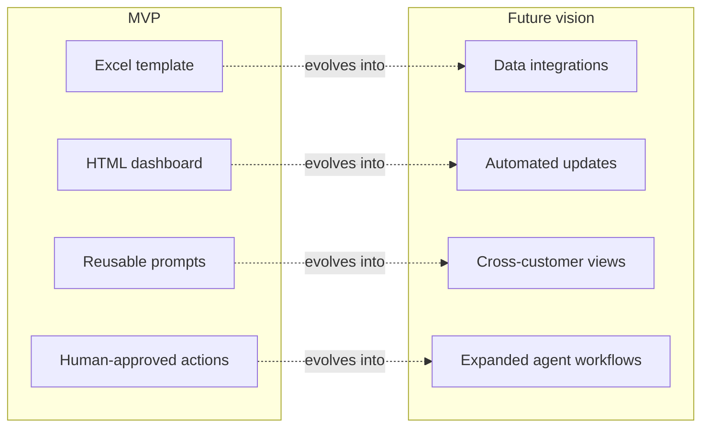

# PartnerPulse Agent Workspace

> A private workspace for designing, documenting, testing, and improving the PartnerPulse experience.

PartnerPulse is a human-in-the-loop workspace concept that helps distributors, resellers, and customer teams manage Microsoft 365 Copilot trials with greater clarity and consistency.

It brings trial information, adoption signals, blockers, follow-up actions, and business-value updates into one repeatable workflow—without replacing human judgment.

---

## Contents

- [Why PartnerPulse?](#why-partnerpulse)
- [How It Works](#how-it-works)
- [Who It Helps](#who-it-helps)
- [Current MVP](#current-mvp)
- [MVP and Future Vision](#mvp-and-future-vision)
- [Privacy and Human Control](#privacy-and-human-control)
- [Repository Structure](#repository-structure)
- [Project Status](#project-status)
- [Important Notice](#important-notice)

---

## Why PartnerPulse?

During a Copilot trial, important information is often scattered across spreadsheets, emails, meeting notes, reminders, and conversations. That makes it harder to answer a few basic questions:

- Who has activated the trial?
- Are participants using Copilot?
- What is blocking adoption?
- What should happen next?
- Is the trial producing enough value to support a business decision?

PartnerPulse is designed to turn those scattered activities into a clear, repeatable process.

### Before and After

| Without PartnerPulse | With PartnerPulse |
| --- | --- |
| Information is spread across multiple locations | Information is organized into one workflow |
| Follow-ups depend on manual tracking | Recommended follow-ups are clearly identified |
| Adoption risks may be discovered late | Risks and blockers can be surfaced earlier |
| Reports require manual preparation | Summaries and draft communications can be prepared faster |
| Every trial may be managed differently | Reusable templates create consistency |

---

## How It Works



### Workflow at a Glance

1. **Start the trial** — A customer begins a Microsoft 365 Copilot trial.
2. **Collect information** — Authorized users record dates, licenses, activation, usage, blockers, and business value.
3. **Review progress** — PartnerPulse identifies gaps, risks, blockers, and opportunities for support.
4. **Display status** — A dashboard shows trial health, adoption progress, missing updates, and recommended actions.
5. **Recommend next steps** — The agent may suggest training, follow-ups, sponsor reviews, or usage check-ins.
6. **Review with a human** — People approve, modify, or reject recommendations before important actions are taken.
7. **Record outcomes** — Completed actions and results inform future recommendations.

> **Important:** PartnerPulse prepares information and recommendations. People remain responsible for decisions and communications.

---

## Who It Helps

| Role | How PartnerPulse helps |
| --- | --- |
| **Distributor** | Understand adoption patterns and trends across supported partners. |
| **Reseller** | Identify customers who may need additional support or follow-up. |
| **Customer / Copilot Champion** | Track progress, blockers, participation, and business value. |



---

## Current MVP

The current MVP is intentionally lightweight and designed for understandable, human-reviewed workflows.

### 1. Excel Input Template

Tracks:

- Trial dates
- License assignments
- Activation status
- Usage activity
- Blockers
- Follow-up ownership

### 2. HTML Dashboard

Displays:

- Trial status
- Adoption indicators
- Risks and blockers
- Recommended next actions
- Sponsor-review readiness

### 3. Reusable Prompts

Provides copy-and-paste prompts for:

- Trial reviews
- Status summaries
- Missing-information checks
- Follow-up recommendations
- Customer communications

### 4. Agent Design Documentation

Defines how future PartnerPulse agents may:

- Review approved information
- Identify risks and missing data
- Recommend actions
- Draft communications
- Maintain human-approval workflows

---

## MVP and Future Vision



---

## Privacy and Human Control

PartnerPulse follows a privacy-first design. The workspace should help teams work with information responsibly, transparently, and with appropriate human oversight.

### Design Principles

- Keep customer information in customer-controlled environments.
- Use aliases or aggregated information whenever possible.
- Avoid unnecessary customer identifiers.
- Never invent missing information.
- Clearly label unknown, incomplete, or unverified data.
- Require human review for important actions and communications.
- Treat adoption data as support information—not employee performance information.

---

## Repository Structure

```text
PartnerPulse-Agent-Workspace/
├── README.md
├── prompts/
│   ├── partnerpulse-agent.md
│   ├── research-agent.md
│   ├── supervisor-agent.md
│   └── summary-agent.md
├── templates/
│   ├── agent-template.md
│   ├── prompt-template.md
│   ├── requirements-template.md
│   └── meeting-notes-template.md
├── architecture/
│   ├── workflow.md
│   ├── data-flow.md
│   ├── integrations.md
│   └── security-considerations.md
├── notes/
│   ├── meeting-notes.md
│   ├── research-findings.md
│   ├── decisions.md
│   └── lessons-learned.md
└── examples/
    ├── sample-customer-scenario.md
    └── sample-agent-output.md
```

---

## Project Status

**Status:** In progress

### Current Priorities

- Define and validate the MVP.
- Document agent responsibilities.
- Organize reusable prompts.
- Create workflows that non-technical users can understand.
- Build realistic examples without using real customer data.

---

## Important Notice

This repository is a private project workspace.

**Do not store:**

- Real customer data
- Passwords
- API keys
- Access tokens
- Confidential tenant information
- Personal participant information
- Unapproved recordings or transcripts

When in doubt, use fictional, anonymized, or aggregated examples.
