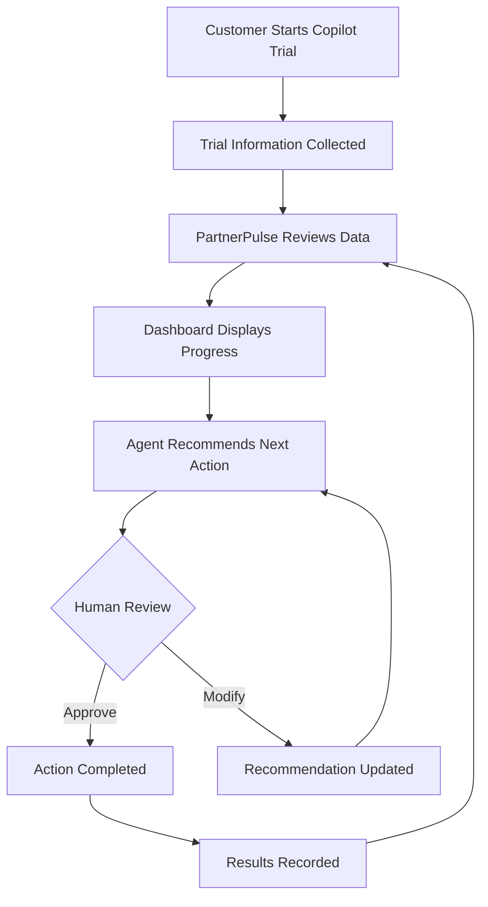
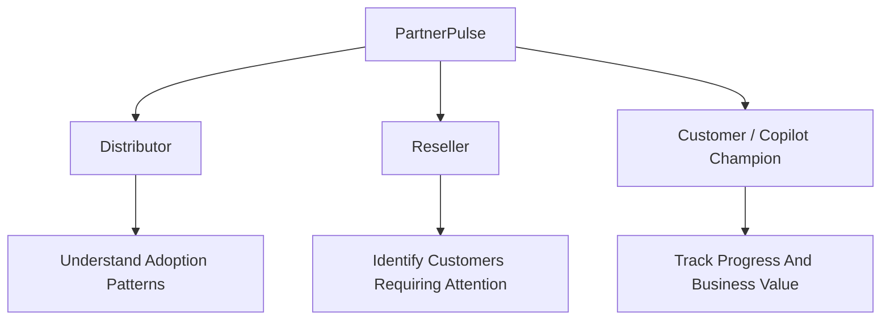
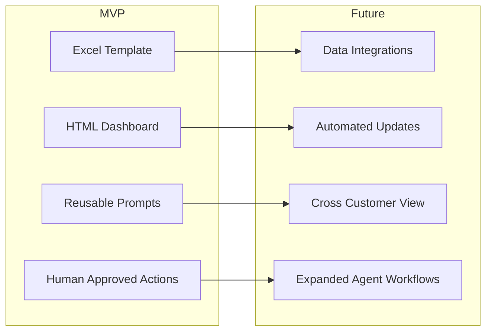

# PartnerPulse Agent Workspace

> A private workspace for designing, documenting, testing, and improving the PartnerPulse agent experience.

---

## What Is PartnerPulse?

PartnerPulse is a concept for helping distributors, resellers, and customer teams manage Microsoft 365 Copilot trials more effectively.

During a trial, important information is often spread across spreadsheets, emails, meeting notes, reminders, and conversations. This can make it difficult to understand:

- Who has activated the trial
- Whether participants are actively using Copilot
- What blockers are slowing adoption
- Which follow-up action should happen next
- Whether the trial is producing enough value to support a business decision

PartnerPulse is intended to bring this information into a single, understandable workflow.

The goal is not to replace people. Instead, PartnerPulse helps organize information, highlight risks, recommend next steps, and prepare communications for human review.

---

## The Problem in Plain Language

Imagine a reseller managing several Copilot trials at the same time.

Without a common system, they may need to:

- Check multiple spreadsheets
- Contact customers manually
- Look for missing updates
- Track trial activity
- Prepare sponsor summaries
- Remember when follow-up is needed
- Determine which customers need help

PartnerPulse is designed to turn those scattered activities into a repeatable process.

---

## Before and After PartnerPulse

| Before PartnerPulse | With PartnerPulse |
|--------------------|------------------|
| Information is spread across multiple locations | Information is organized into one workflow |
| Follow-ups depend on manual tracking | Recommended follow-ups are clearly identified |
| Problems may be discovered late | Adoption risks can be identified earlier |
| Reports require manual preparation | Summaries and draft communications can be generated |
| Every trial may be managed differently | Reusable templates create consistency |

---

## How PartnerPulse Works



---

## Workflow Explained

### 1. Start the Trial
A customer begins a Microsoft 365 Copilot trial.

### 2. Collect Trial Information
Authorized users record information such as:

- Trial dates
- License assignments
- Activation status
- Usage progress
- Reported blockers
- Business value

### 3. Review Progress
PartnerPulse organizes available information and identifies gaps, blockers, and opportunities for improvement.

### 4. Display Current Status
The dashboard presents:

- Trial health
- Adoption progress
- Missing updates
- Known blockers
- Recommended next actions

### 5. Recommend Next Actions
Examples include:

- Training sessions
- Follow-ups
- Sponsor reviews
- Check-ins
- Usage reviews

### 6. Human Review
People remain in control.

PartnerPulse prepares recommendations and draft communications, but humans decide what action to take.

### 7. Record Results
Completed actions are recorded and used to drive future recommendations.

---

## Who Benefits?



### Distributor
Uses summarized information to understand adoption trends across supported partners.

### Reseller
Uses PartnerPulse to identify which customers may require additional support.

### Customer / Copilot Champion
Uses PartnerPulse to track progress, blockers, participation, and business value.

---

## Current MVP

### Excel Input Template

Tracks:

- Trial dates
- License assignments
- Activation status
- Usage activity
- Blockers
- Follow-up ownership

### HTML Dashboard

Displays:

- Trial status
- Adoption indicators
- Risks and blockers
- Recommended next actions
- Sponsor review readiness

### Reusable Prompts

Provides copy-and-paste prompts for:

- Trial reviews
- Status summaries
- Missing information checks
- Follow-up recommendations
- Customer communications

### Agent Design Documentation

Defines how future PartnerPulse agents may:

- Review approved information
- Identify risks
- Recommend actions
- Draft communications
- Maintain human approval workflows

---

## Current MVP vs Future Vision



---

## Privacy and Human Control

PartnerPulse follows a privacy-first design.

### Design Principles

- Keep customer information in customer-controlled environments
- Use aliases or aggregated information where possible
- Avoid unnecessary customer identifiers
- Never invent missing information
- Clearly identify unknown or missing data
- Require human review for important actions
- Treat adoption data as support information, not employee performance information

---

## Repository Structure

```text
PartnerPulse-Agent-Workspace/

├── README.md

├── prompts/
│   ├── partnerpulse-agent.md
│   ├── research-agent.md
│   ├── supervisor-agent.md
│   └── summary-agent.md

├── templates/
│   ├── agent-template.md
│   ├── prompt-template.md
│   ├── requirements-template.md
│   └── meeting-notes-template.md

├── architecture/
│   ├── workflow.md
│   ├── data-flow.md
│   ├── integrations.md
│   └── security-considerations.md

├── notes/
│   ├── meeting-notes.md
│   ├── research-findings.md
│   ├── decisions.md
│   └── lessons-learned.md

└── examples/
    ├── sample-customer-scenario.md
    └── sample-agent-output.md
```

---

## Project Status

**Status:** In Progress

### Current Priorities

- Define the MVP
- Document agent responsibilities
- Organize reusable prompts
- Create understandable workflows
- Build examples that non-technical users can follow

---

## Important Notice

This repository is a private project workspace.

Do not store:

- Real customer data
- Passwords
- API keys
- Access tokens
- Confidential tenant information
- Personal participant information
- Unapproved recordings or transcripts
